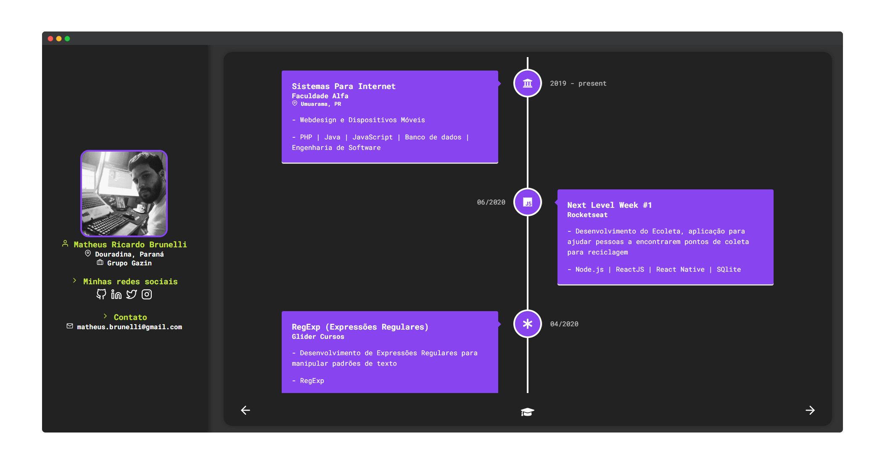
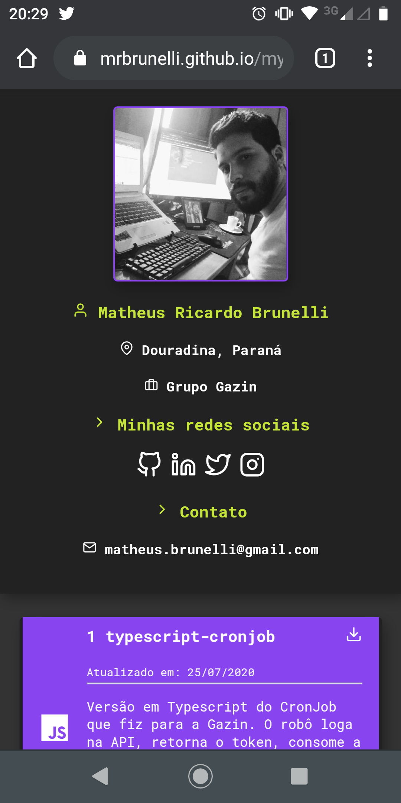

<h3 align="center">
    
     
    <b>My Portfolio</b>
     
    <code>Disponível online <a href="https://mrbrunelli.github.io/my-portfolio" target="_blank">aqui</a></code>
</h3>

 
 

## :bulb: Tecnologias Utilizadas
- [x] **TypeScript**
- [x] **ReactJS**
- [x] **CSS GRID LAYOUT**

## :cool: Agora também em versão responsível
> Print do meu Smartphone

